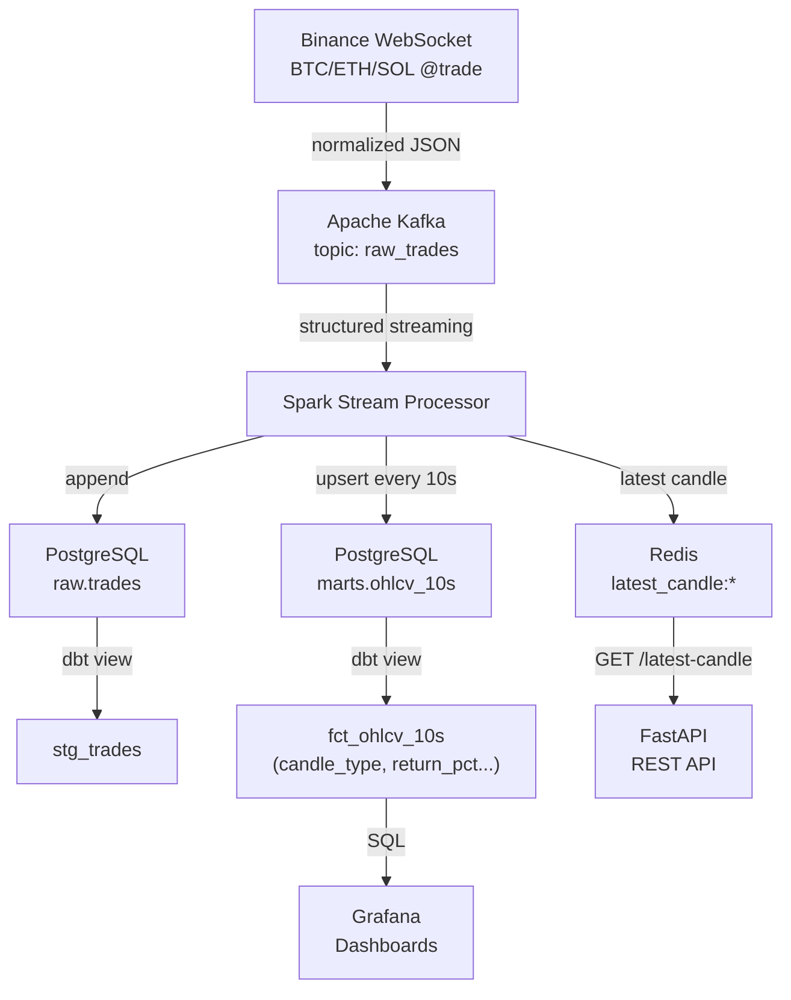
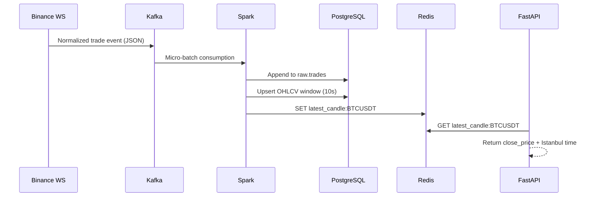
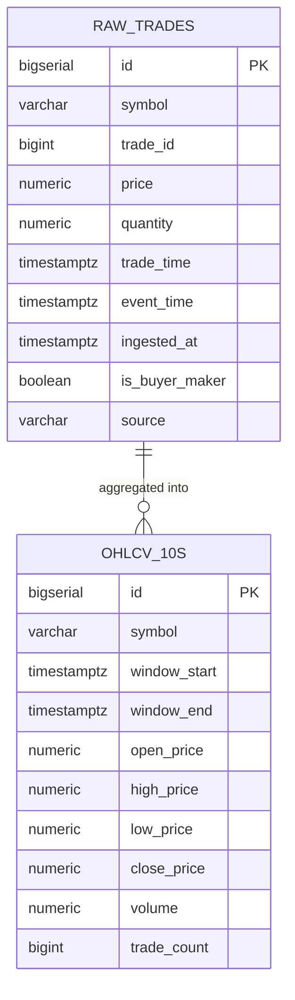
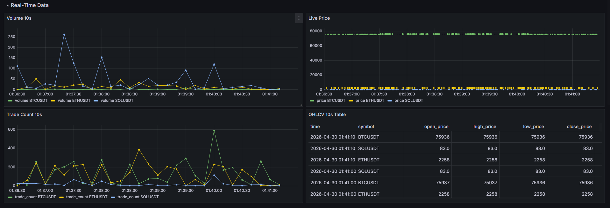
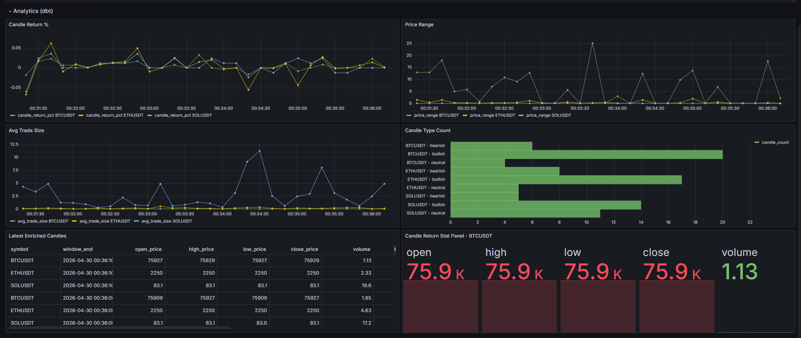
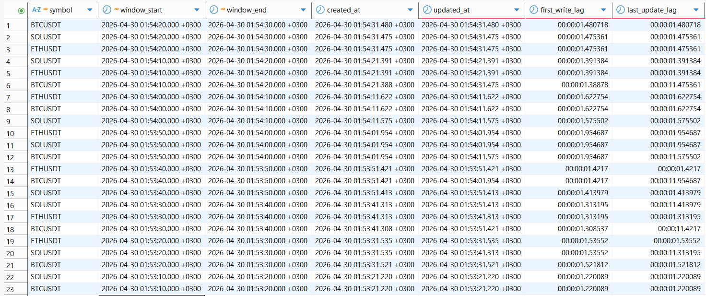

# Real-Time Crypto Streaming Pipeline

A production-style, end-to-end streaming data platform that ingests live trade data from Binance, processes it with Apache Spark, stores it in PostgreSQL, and serves it through a low-latency REST API — all containerized with Docker.

> **Symbols tracked:** `BTCUSDT` · `ETHUSDT` · `SOLUSDT`

---

## Architecture Overview



---

## Tech Stack

| Layer | Technology |
|---|---|
| **Ingestion** | Python · Binance WebSocket · `confluent-kafka` |
| **Message Queue** | Apache Kafka + Zookeeper (Confluent 7.6) |
| **Stream Processing** | Apache Spark Structured Streaming (PySpark) |
| **Storage** | PostgreSQL 16 |
| **Caching** | Redis 7.2 |
| **Transformation** | dbt (views on top of PostgreSQL) |
| **API** | FastAPI |
| **Visualization** | Grafana 10.4 |
| **Orchestration** | Docker Compose |

---

## Data Flow



---

## Database Schema



---

## Project Structure

```
.
├── producer/
│   └── binance_producer.py      # WebSocket → Kafka
├── spark/
│   ├── stream_processor.py      # Kafka → Postgres + Redis
│   └── update_latest_candles.py # Fallback Redis writer
├── api/
│   └── main.py                  # FastAPI endpoints
├── dbt/
│   ├── models/staging/
│   │   └── stg_trades.sql
│   └── models/marts/
│       └── fct_ohlcv_10s.sql
├── init/
│   └── init.sql                 # DB schema bootstrap
└── docker-compose.yml
```

---

## Getting Started

### Prerequisites

- Docker & Docker Compose
- `.env` file (see below)

### Environment Variables

Create a `.env` file in the project root:

```env
KAFKA_EXTERNAL_PORT=9092

POSTGRES_DB=crypto
POSTGRES_USER=postgres
POSTGRES_PASSWORD=yourpassword
POSTGRES_PORT=5432

REDIS_PORT=6379
GRAFANA_PORT=3000
API_PORT=8000

REFRESH_SECONDS=10
```

### Run

```bash
# Start all services
docker compose up -d

# Check logs
docker compose logs -f spark-processor
docker compose logs -f producer
```

---

## API Endpoints

Base URL: `http://localhost:8000`

| Method | Endpoint | Description |
|---|---|---|
| `GET` | `/symbols` | List all tracked symbols |
| `GET` | `/latest-candle/{symbol}` | Full OHLCV candle for a symbol |
| `GET` | `/latest-price/{symbol}` | Close price + UTC & Istanbul time |

**Example:**

```bash
curl http://localhost:8000/latest-price/BTCUSDT
```

```json
{
  "symbol": "BTCUSDT",
  "price": 67432.10,
  "time_utc": "2024-05-01T12:00:00+00:00",
  "time_tr": "2024-05-01T15:00:00+03:00"
}
```

---

## dbt Models

### `stg_trades` (view · staging schema)
Cleaned and enriched trades from `raw.trades` — filters nulls, adds `trade_time_second`, `trade_time_minute`, and `ingestion_delay`.

### `fct_ohlcv_10s` (view · marts schema)
Enriched OHLCV candles with derived metrics:

| Column | Description |
|---|---|
| `candle_type` | `bullish` / `bearish` / `neutral` |
| `candle_return_pct` | `(close - open) / open × 100` |
| `price_range` | `high - low` |
| `candle_body` | `close - open` |
| `avg_trade_size` | `volume / trade_count` |

---

## Screenshots

### Real-Time Data Dashboard
Live 10-second OHLCV candles, volume and trade count per symbol, and a live price feed — all updating in real time via Grafana.



### Analytics Dashboard (dbt)
Enriched metrics powered by dbt views: candle return %, price range, avg trade size, candle type distribution, and a stat panel for BTCUSDT.



### Write Latency

Measured streaming latency from OHLCV `window_end` to PostgreSQL write timestamps.

During the observed run, the first write of most 10-second OHLCV candles completed within approximately **1–2 seconds** after the aggregation window closed. Some windows received later updates, with `last_update_lag` reaching around **11 seconds**, reflecting Spark Structured Streaming updates for open or recently closed aggregation windows.



> Screenshots were captured live while the pipeline was running. Place image files under `docs/screenshots/` in your repo.

---

## Key Design Decisions

**Watermark + update mode** — Spark processes OHLCV windows with a 5-second watermark, tolerating slight late arrivals while allowing the `update` output mode for efficient upserts.

**Redis as the serving layer** — Spark writes the latest candle directly to Redis after each micro-batch, keeping API latency in single-digit milliseconds regardless of PostgreSQL query load.

**Upsert on conflict** — OHLCV records use `ON CONFLICT (symbol, window_start, window_end) DO UPDATE`, so reprocessing is idempotent.

**Fallback writer** — `update_latest_candles.py` can re-sync Redis from PostgreSQL independently of Spark, useful during restarts or debugging.

---
